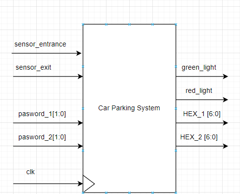
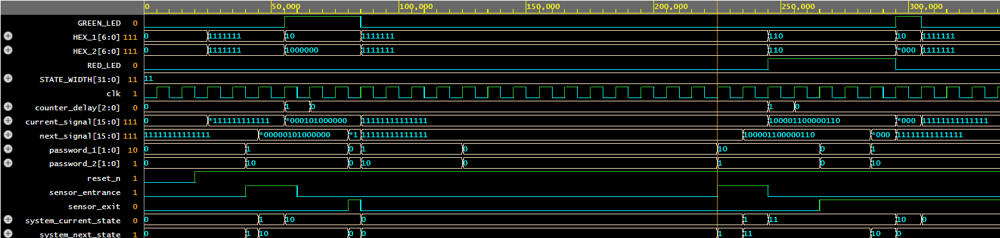

# CAR PARKING SYSTEM:

## Abstract:
  

## INTRODUCTION:

Drivers searching for parking are estimated to be responsible for about 30% of
traffic congestion in cities. Historically, cities, businesses, and property developers
have tried to match parking supply to growing demand for parking spaces. 

Parking System can be defined as the use of advanced technologies for the better
operation, controlling of traffic, and management of parking within an urban area.
 A number of technologies provide the basis for parking solutions, including vehicle sensors,
wireless communications, and data analytics. Parking System is also made useful by
 recent technology in areas such as mobile appilcation customer services, mobile UPI payments,
and in-car GPS navigation systems. At the heart of the parking system concept is the ability
to access, collect, analyze, disseminate, and act on information on parking usage.
Increasingly, this information is provided in real-time from intelligent devices that
enable both parking managers and drivers to optimize the use of parking capacity.

## Motivation to use Parking System:

1. New Revenue Streams – Many new revenue streams are possible with smart
parking technology. For example, lot owners can enable tiered payment options
dependent on parking space location. Also, reward programs can be integrated
into existing models to encourage repeat users.
2.Integrated Payments and POS – Returning users can replace daily, manual cash 
payments with account invoicing and application payments from their phone.
This could also enable customer loyalty programs and valuable user feedback.

3. Real-Time Data and Trend Insight – Over time, a smart parking solution can
produce data that uncovers correlations and trends of users and lots. These trends
can prove to be invaluable to lot owners as to how to make adjustments and
improvements to drivers.

4. Reduced pollution – Searching for parking burns around one million barrels of oil
a day. An optimal parking solution will significantly decrease driving time, thus
lowering the amount of daily vehicle emissions and ultimately reducing the
global environmental footprint.


5. Enhanced User Experience – A smart parking solution will integrate the entire
user experience into a unified action. Driver’s payment, spot identification,
location search and time notifications all seamlessly become part of the
destination arrival process.


6. Optimized parking – Users find the best spot available, saving time, resources
and effort. The parking lot fills up efficiently and space can be utilized properly
by commercial and corporate entities.

7. Reduced traffic – Traffic flow increases as fewer cars are required to drive around
in search of an open parking space.


8. Increased Safety – Parking lot employees and security guards contain real-time
lot data that can help prevent parking violations and suspicious activity. License
plate recognition cameras can gather pertinent footage. Also, decreased spotsearching traffic on the streets can reduce accidents caused by the distraction of searching for parking.

9. Real-Time Data and Trend Insight – Over time, a smart parking solution can
produce data that uncovers correlations and trends of users and lots. These trends
can prove to be invaluable to lot owners as to how to make adjustments and
improvements to drivers.
10. Decreased Management Costs – More automation and less manual activity saves
  on labor cost and resource exhaustion.

## Significance:
The smart parking system is considered beneficial for the
car park operators, car park patrons as well as in environment
conservation.

## Operation:  

In the entrance of the parking system, there is a sensor which is activated to detect a vehicle coming. 
Once the sensor is triggered, a password is requested to open the gate. 
If the entered password is correct, the gate would open to let the vehicle get in.
Otherwise, the gate is still locked. 
If the current car is getting in the car park being detected by the exit sensor and another the car comes, the door will be locked and requires the coming car to enter passwords.

## Car Parking System block:

  

## FSM For Car Parking System:

  

### FSM block:

  

### FSM Synthesis block:

  

## Full code for Car Parking System:

```SystemVerilog
`timescale 1ns / 1ps

module parking_system(
    input logic clk, reset_n,
    input logic sensor_entrance, sensor_exit,
    input logic [1:0] password_1, password_2,
    output logic GREEN_LED, RED_LED,
    output logic [6:0] HEX_1, HEX_2
);

    logic [2:0] counter_delay;
    localparam STATE_WIDTH = 3;
    
    typedef enum logic [STATE_WIDTH-1:0] {
        IDLE,
        WAIT_PASSWORD_IN,
        RIGHT_PASSWORD_IN,
        WRONG_PASSWORD_IN,
        STOP
    } SYSTEM_STATE;
    
    SYSTEM_STATE system_current_state, system_next_state;
    
    typedef struct packed {
        logic green_led, red_led;
        logic [6:0] HEX_1, HEX_2;
    } signal_out;
    
    signal_out current_signal, next_signal;
    
    always_ff @(posedge clk or negedge reset_n) begin : fsm_ff_proc
        if (!reset_n) begin
            system_current_state <= IDLE;
            current_signal <= '{default: 0};
        end else begin
            system_current_state <= system_next_state;
            current_signal <= next_signal;
        end
    end : fsm_ff_proc
    
    always_ff @(posedge clk or negedge reset_n) begin : counter_proc
        if (!reset_n) begin
            counter_delay <= 0;
        end else if (system_current_state == WAIT_PASSWORD_IN ) begin
            counter_delay <= counter_delay + 1;
        end else begin
            counter_delay <= 0;
        end
    end : counter_proc
    
    always_comb begin : fsm_comb_proc
        system_next_state = IDLE;
        next_signal = '{default: 0};
        
        case (system_current_state)
            IDLE: begin
                if (sensor_entrance == 1 && sensor_exit == 0) begin
                    system_next_state = WAIT_PASSWORD_IN;
                    next_signal.green_led = 0;
                    next_signal.red_led = 1;
                    next_signal.HEX_1 = 7'b0000110;	// E
                    next_signal.HEX_2 = 7'b0101011;	// n
                
                end else begin
                    system_next_state = IDLE;
                    next_signal.green_led = 0;
                    next_signal.red_led = 0;
                    next_signal.HEX_1 = 7'b1111111; // off
                    next_signal.HEX_2 = 7'b1111111;	// off
                end
            end
            
            WAIT_PASSWORD_IN: begin
                if (counter_delay <= 3) begin
                    system_next_state = WAIT_PASSWORD_IN;
                end
              if ((password_1 == 2'b01) && (password_2 == 2'b10)) begin
                    system_next_state = RIGHT_PASSWORD_IN;
                    next_signal.green_led = 1;
                    next_signal.red_led = 0;
                    next_signal.HEX_1 = 7'b0000010;	// 6
                    next_signal.HEX_2 = 7'b1000000;	// 0
                end else begin
                    system_next_state = WRONG_PASSWORD_IN;
                    next_signal.green_led = 0;
                    next_signal.red_led = 1;
                    next_signal.HEX_1 = 7'b0000110;	// E
                    next_signal.HEX_2 = 7'b0000110;	// E
                end
            end
            
            RIGHT_PASSWORD_IN: begin
                if (sensor_entrance == 1 && sensor_exit == 1) begin
                    system_next_state = STOP;
                    next_signal.green_led = 0;
                    next_signal.red_led = 1;
                    next_signal.HEX_1 = 7'b0010010;	// 5
                    next_signal.HEX_2 = 7'b0001100;	// P
                end else if (sensor_exit == 1) begin
                    system_next_state = IDLE;
                    next_signal.green_led = 0;
                    next_signal.red_led = 0;
                    next_signal.HEX_1 = 7'b1111111;	// off
                    next_signal.HEX_2 = 7'b1111111; // off
                end else begin
                    system_next_state = RIGHT_PASSWORD_IN;
                    next_signal.green_led = 1;
                    next_signal.red_led = 0;
                    next_signal.HEX_1 = 7'b0000010;	// 6
                    next_signal.HEX_2 = 7'b1000000;	// 0
                end
            end
            
            WRONG_PASSWORD_IN: begin
                if ((password_1 == 2'b01) && (password_2 == 2'b10)) begin
                    system_next_state = RIGHT_PASSWORD_IN;
                    next_signal.green_led = 1;
                    next_signal.red_led = 0;
                    next_signal.HEX_1 = 7'b0000010;	// 6
                    next_signal.HEX_2 = 7'b1000000;	// 0
                end else begin
                    system_next_state = WRONG_PASSWORD_IN;
                    next_signal.green_led = 0;
                    next_signal.red_led = 1;
                    next_signal.HEX_1 = 7'b0000110;	// E
                    next_signal.HEX_2 = 7'b0000110;	// E
                end
            end
            
            
          STOP:	begin
            
   			 if((password_1 == 2'b01) && (password_2 == 2'b10))	begin
              		system_next_state = RIGHT_PASSWORD_IN;
                    next_signal.green_led = 1;
                    next_signal.red_led = 0;
                    next_signal.HEX_1 = 7'b0000010;	// 6
                    next_signal.HEX_2 = 7'b1000000;	// 0
            end
            else	begin
              		system_next_state = STOP;
                    next_signal.green_led = 0;
                    next_signal.red_led = 1;
                    next_signal.HEX_1 = 7'b0010010;	// 5
                    next_signal.HEX_2 = 7'b0001100;	// P
            end
          end
        endcase
    end : fsm_comb_proc
    
    assign GREEN_LED = current_signal.green_led;
    assign RED_LED = current_signal.red_led;
    assign HEX_1 = current_signal.HEX_1;
    assign HEX_2 = current_signal.HEX_2;
    
endmodule : parking_system

```

### Testbench code:

```SystemVerilog
`timescale 1ns / 1ps

module tb_parking_system;

    // Inputs
    reg clk;
    reg reset_n;
    reg sensor_entrance;
    reg sensor_exit;
    reg [1:0] password_1;
    reg [1:0] password_2;

    // Outputs
    wire GREEN_LED;
    wire RED_LED;
    wire [6:0] HEX_1;
    wire [6:0] HEX_2;

    // Instantiate the parking_system module
    parking_system uut (
        .clk(clk),
        .reset_n(reset_n),
        .sensor_entrance(sensor_entrance),
        .sensor_exit(sensor_exit),
        .password_1(password_1),
        .password_2(password_2),
        .GREEN_LED(GREEN_LED),
        .RED_LED(RED_LED),
        .HEX_1(HEX_1),
        .HEX_2(HEX_2)
    );

    // Clock generation
    initial begin
        clk = 0;
        forever #5 clk = ~clk; // 100 MHz clock
    end

    // Test sequence
    initial begin
      $dumpfile("dump.vcd"); $dumpvars;
        // Initialize inputs
        reset_n = 0;
        sensor_entrance = 0;
        sensor_exit = 0;
        password_1 = 2'b00;
        password_2 = 2'b00;

        // Wait for global reset
        #20;
        reset_n = 1;

        // Test case 1: Entrance sensor activated, correct password
        #20;
        sensor_entrance = 1;
        sensor_exit = 0;
        password_1 = 2'b01;
        password_2 = 2'b10;

        // Wait for system to process
        #20;
        sensor_entrance = 0;
      	sensor_exit = 0;
      	#20
        // Deactivate sensors
        sensor_entrance = 0;
      	sensor_exit = 1;
        password_1 = 2'b00;
        password_2 = 2'b00;
        
		#5
// 		Test case 2:
      	sensor_entrance = 0;
        sensor_exit = 0;
        password_1 = 2'b01;
        password_2 = 2'b10;

        // Wait for system to process
        #40;
        
        // Deactivate sensors
        sensor_entrance = 0;
      	sensor_exit = 0;
        password_1 = 2'b00;
        password_2 = 2'b00;
      	  
      	#100
//       Test case 3:
      	sensor_entrance = 1;
        sensor_exit = 0;
        password_1 = 2'b10;
        password_2 = 2'b01;

        // Wait for system to process
        #20;
        sensor_entrance = 0;
        sensor_exit = 0;
      	#20
        // Deactivate sensors
        sensor_entrance = 0;
      	sensor_exit = 1;
        password_1 = 2'b00;
        password_2 = 2'b00;
      	#20
      	password_1 = 2'b01;
        password_2 = 2'b10;
      	#20
      	sensor_entrance = 0;
      	sensor_exit = 1;
        // End simulation
        #100;
        $finish;
    end

endmodule
```

## Simulation:

  

My code in EDA Playground: [Car Parking System](https://edaplayground.com/x/f7zm)
