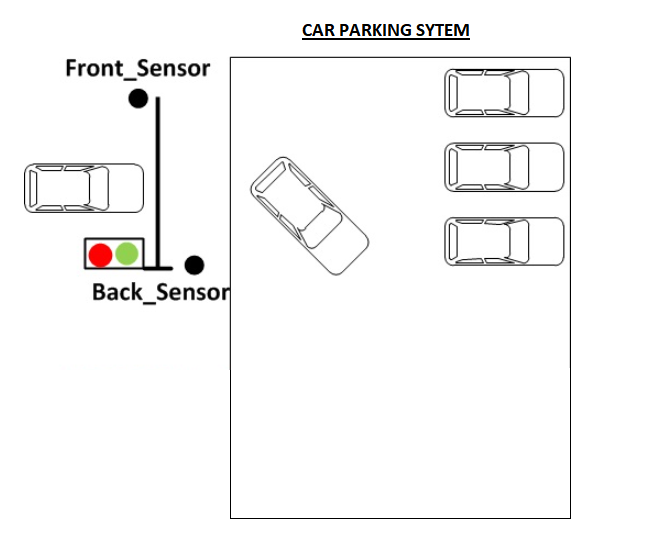
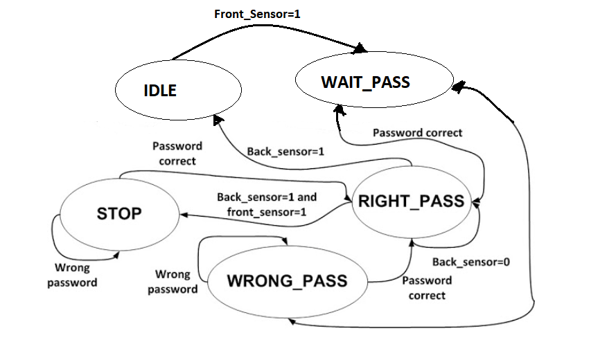
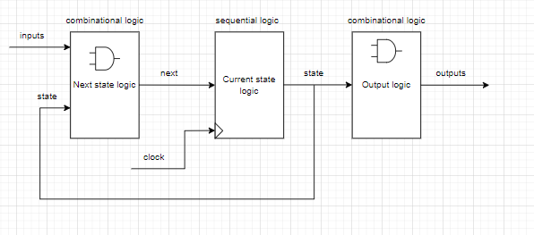

# CAR PARKING SYSTEM:

## Abstract:
  

## INTRODUCTION:

Drivers searching for parking are estimated to be responsible for about 30% of
traffic congestion in cities. Historically, cities, businesses, and property developers
have tried to match parking supply to growing demand for parking spaces. 

Parking System can be defined as the use of advanced technologies for the better
operation, controlling of traffic, and management of parking within an urban area.
 A number of technologies provide the basis for parking solutions, including vehicle sensors,
wireless communications, and data analytics. Parking System is also made useful by
 recent technology in areas such as mobile appilcation customer services, mobile UPI payments,
and in-car GPS navigation systems. At the heart of the parking system concept is the ability
to access, collect, analyze, disseminate, and act on information on parking usage.
Increasingly, this information is provided in real-time from intelligent devices that
enable both parking managers and drivers to optimize the use of parking capacity.

## Motivation to use Parking System:

1. New Revenue Streams – Many new revenue streams are possible with smart
parking technology. For example, lot owners can enable tiered payment options
dependent on parking space location. Also, reward programs can be integrated
into existing models to encourage repeat users.
2.Integrated Payments and POS – Returning users can replace daily, manual cash 
payments with account invoicing and application payments from their phone.
This could also enable customer loyalty programs and valuable user feedback.

3. Real-Time Data and Trend Insight – Over time, a smart parking solution can
produce data that uncovers correlations and trends of users and lots. These trends
can prove to be invaluable to lot owners as to how to make adjustments and
improvements to drivers.

4. Reduced pollution – Searching for parking burns around one million barrels of oil
a day. An optimal parking solution will significantly decrease driving time, thus
lowering the amount of daily vehicle emissions and ultimately reducing the
global environmental footprint.

5. Enhanced User Experience – A smart parking solution will integrate the entire
user experience into a unified action. Driver’s payment, spot identification,
location search and time notifications all seamlessly become part of the
destination arrival process.

6. Optimized parking – Users find the best spot available, saving time, resources
and effort. The parking lot fills up efficiently and space can be utilized properly
by commercial and corporate entities.

7. Reduced traffic – Traffic flow increases as fewer cars are required to drive around
in search of an open parking space.

8. Increased Safety – Parking lot employees and security guards contain real-time
lot data that can help prevent parking violations and suspicious activity. License
plate recognition cameras can gather pertinent footage. Also, decreased spotsearching traffic on the streets can reduce accidents caused by the distraction of searching for parking.

9. Real-Time Data and Trend Insight – Over time, a smart parking solution can
produce data that uncovers correlations and trends of users and lots. These trends
can prove to be invaluable to lot owners as to how to make adjustments and
improvements to drivers.
10. Decreased Management Costs – More automation and less manual activity saves
  on labor cost and resource exhaustion.

## Significance:
The smart parking system is considered beneficial for the
car park operators, car park patrons as well as in environment
conservation.

## Operation:  

In the entrance of the parking system, there is a sensor which is activated to detect a vehicle coming. 
Once the sensor is triggered, a password is requested to open the gate. 
If the entered password is correct, the gate would open to let the vehicle get in.
Otherwise, the gate is still locked. 
If the current car is getting in the car park being detected by the exit sensor and another the car comes, the door will be locked and requires the coming car to enter passwords.

## FSM For Car Parking System:

  

### FSM block:

  

### FSM Synthesis block:

  

